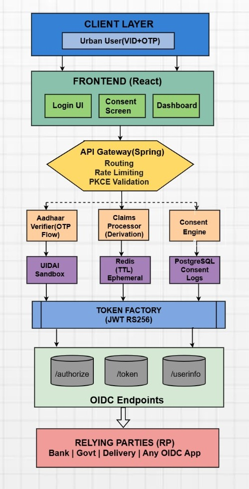
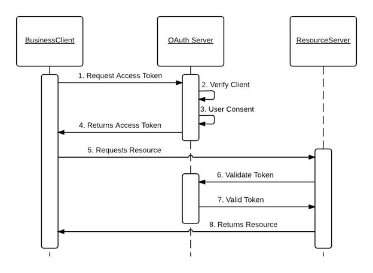
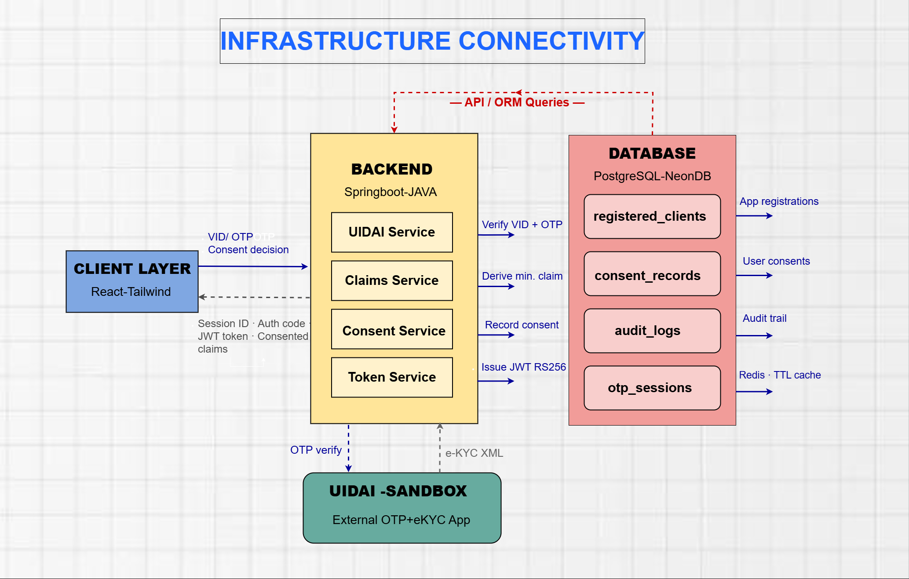
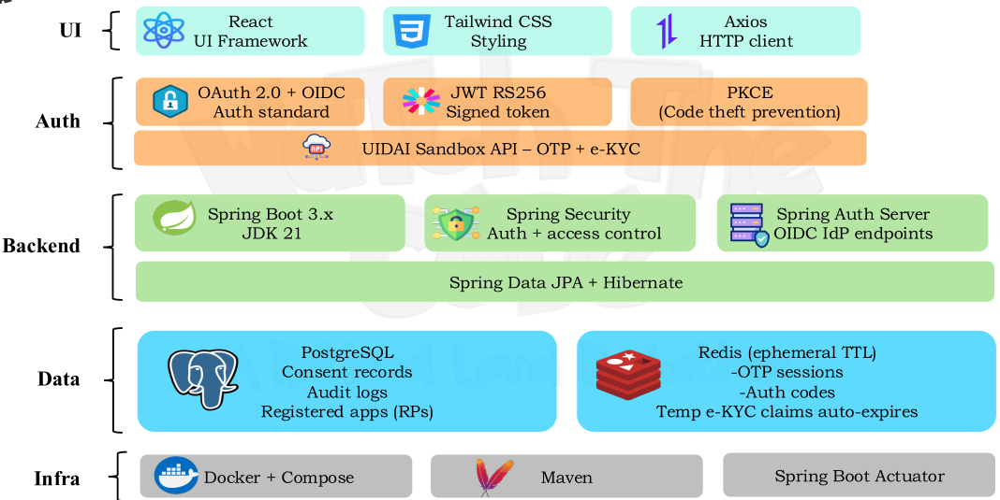
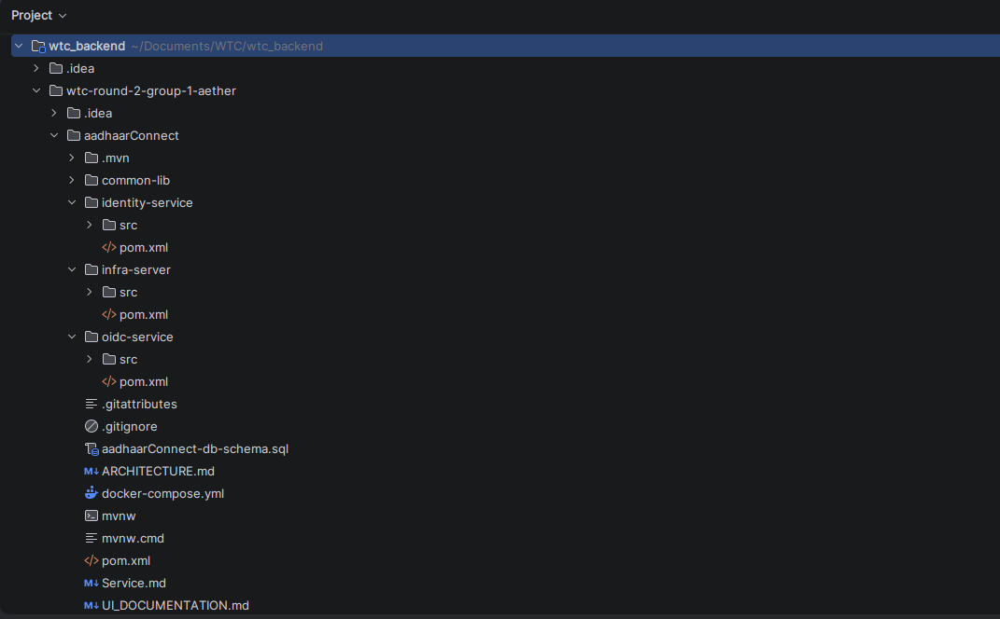

[](https://classroom.github.com/a/MRKLRW_0)
[](https://classroom.github.com/online_ide?assignment_repo_id=23519151&assignment_repo_type=AssignmentRepo)


 **Privacy-first identity layer for Aadhaar-based authentication**
>**Team AETHER**

---

## Overview

**AadhaarConnect** is a standards-based **OpenID Connect (OIDC) Identity Provider** built on India's Aadhaar authentication infrastructure. It enables any application to offer **"Login with Aadhaar"** — exactly like "Login with Google" — without ever collecting, storing, or exposing raw Aadhaar data.

Instead of every app building its own fragile UIDAI integration and storing full KYC dumps, AadhaarConnect acts as a **trusted middleman**:

- Verifies identity **once** via UIDAI Sandbox OTP + e-KYC
- Derives only the **minimum required attributes** — `age_over_18`, `state_of_residence` — never raw DOB or full address
- Issues a **RS256-signed JWT token** carrying only what the user explicitly consented to share
- Gives users a **dashboard to view and revoke** every app's access at any time

---

## Problem Statement

India performs over **10 million Aadhaar verifications daily**. Every verification today follows the same broken pattern:

| Problem | Impact |
|---------|--------|
| **Data overreach** | Apps call UIDAI directly and receive full KYC — name, DOB, address, photo, mobile — even when only one field is needed |
| **Permanent storage** | All raw KYC data is stored permanently in app databases, long after verification is complete |
| **No user control** | Users have no consent screen, no visibility into what was shared, and no way to revoke access |
| **No unified standard** | Every app builds its own fragile UIDAI integration — there is no equivalent of "Login with Google" for Aadhaar |
| **Breach risk** | One database breach exposes complete identity profiles of every user who ever verified through that platform |

**AadhaarConnect solves all of this** with a single, standards-based identity layer.

---

## Architecture

### Three-Layer Model

| Layer | Component | Responsibility |
|-------|-----------|----------------|
| **Layer 1** | Relying Parties (Apps) | Speak standard OIDC. Never touch UIDAI directly. |
| **Layer 2** | AadhaarConnect (IdP Core) | Handles verification, consent, claim derivation, and JWT issuance. |
| **Layer 3** | UIDAI Sandbox | Official Aadhaar authentication API. Only AadhaarConnect communicates here. |



### Microservice Architecture (Backend)

The backend follows an **optimized 3-service architecture**:

| Service | Port | Role |
|---------|------|------|
| `infra-server` | 8080 | API Gateway · Eureka Service Discovery · Config Server · Rate Limiting |
| `identity-service` | 8081 | UIDAI integration · OTP flow · e-KYC derivation · Session management |
| `oidc-service` | 8085 | OAuth 2.0 · OIDC Authority · Consent orchestration · JWT issuance · RP registry |

**Gateway routing rules:**
- `/api/v1/identity/**` → `identity-service`
- `/.well-known/**`, `/authorize`, `/token`, `/api/v1/consent/**` → `oidc-service`

---

### OAuth 2.0 & OIDC Model

AadhaarConnect is built on **OAuth 2.0 Authorization Code Flow with PKCE**, extended by **OpenID Connect (OIDC)** for identity.

- **OAuth 2.0** — Handles delegated authorization. The app never sees Aadhaar data; it only receives a signed token confirming what the user consented to share.
- **OIDC** — Adds an identity layer. The ID Token is a signed JWT proving who the user is, carrying only consented claims.
- **PKCE** — Prevents authorization code interception. The app generates a secret upfront and must prove ownership before tokens are issued.



### Visual Flow

```
[Landing Page]
      │
      ▼
[VID Entry Popup] ──────────────────────► UIDAI /auth/otp
      │                                          │
      ▼                                          ▼
[OTP Screen] ──────────────────────────► UIDAI /auth/verify
      │                                          │
      ▼                                    e-KYC decrypt
[Claims Derived] ◄───────────────────── raw data discarded
      │
      ▼
[Consent Screen] ── Deny ──► access_denied → back to app
      │
    Approve
      │
      ▼
[Auth Code Issued] ──────────────────────► Redirect to app
      │
      ▼  (app backend calls /oauth2/token)
[PKCE Verified · JWT Issued]
      │
      ▼
[Success Screen] ── JWT preview ──► Redirect to app
      │
      ▼
[User Dashboard]
      ├── [Security & Sign-in] ── [App Detail + Revoke]
      └── [Audit Log]
```
---

## System Interactions


---

## Frontend

### Tech Stack

| Technology | Role |
|------------|------|
| React 18 | Component-based UI framework |
| Vite | Build tool and dev server |
| Tailwind CSS | Utility-first styling with glassmorphism + Material Design 3 tokens |
| React Router DOM | Client-side routing with `PrivateRoute` support |
| Axios | HTTP client for backend API calls |


### Routing Structure

```
src/App.jsx  (active entry point via src/main.jsx)
│
├── /                  Landing page
├── /vid               Identity Gateway — VID entry
├── /otp               OTP Verification
├── /consent           Consent Screen
├── /success           Success + JWT preview
├── /dashboard         User Dashboard
├── /security          Security & Sign-in
├── /app-detail        App Detail + Revoke
├── /audit             Audit Map
└── /developer         Developer Portal

src/routes/AppRouter.jsx  (lazy-loaded + PrivateRoute — available)
```

### Screen-by-Screen Breakdown

| # | Route | Screen | What happens |
|---|-------|--------|--------------|
| 1 | `/` | Landing page | Marketing entry point. "Verify with AadhaarConnect" button in nav. No API call — pure static React. |
| 2 | `/vid` | VID entry popup | OAuth popup showing requesting app + claims. User enters 16-digit VID. Calls `POST /api/otp/send`. VID nulled immediately after. |
| 3 | `/otp` | OTP verification | 6-box OTP input. Masked mobile hint. Attempt counter dots. 15-min lockout after 3 fails. Calls `POST /api/otp/verify`. |
| 4 | `/consent` | Consent screen | Per-claim toggles (Required/Optional). Plain-English descriptions. Approve/Deny. Calls `GET /api/consent/pending` then `POST /api/consent/approve`. |
| 5 | `/success` | Auth success | Claims shared summary. Colour-coded JWT preview (red/blue/green). Redirect back to relying party app. |
| 6 | `/dashboard` | User dashboard | Profile + masked VID. Stat cards. Recent activity list. Sidebar navigation. |
| 7 | `/security` | Security & Sign-in | All apps with active consent. Each card shows app name, expiry, and claim names. |
| 8 | `/app-detail` | App detail + revoke | `client_id`, auth standard, token lifetime, per-claim explanations. Danger zone revoke button. |
| 9 | `/audit` | Audit log | Filterable event timeline. Hashed session IDs only — zero PII. Export button. |
| 10 | `/developer` | Developer portal | App registration form. One-time `client_secret` display. Endpoint reference. |

---

## Backend

### Tech Stack

| Technology | Role |
|------------|------|
| Java 21 | Runtime — virtual threads for high concurrency |
| Spring Boot 3.x | Application framework |
| Spring Authorization Server | OIDC endpoints out of the box |
| Spring Security | JWT validation, endpoint protection |
| Spring Data JPA + Hibernate | ORM — Java entities map to PostgreSQL |
| Maven | Dependency management and build |
| Docker + Compose | Local dev environment |



---

## Resources

- 📄 **[👉 Click here to view the complete project documentation](https://docs.google.com/document/d/1JyTlFx4TZ9Hr1HfrMEVuWRvZ4SfUiTUrTZordYm3eOI/edit?usp=sharing)**

- 
- 🎥 **Demo Video** — 

https://github.com/user-attachments/assets/90dc1e64-2d7b-49ef-81f8-705e2765b23b


---

## Team

| | Name | Role | Responsibilities |
|--|------|------|-----------------|
| <a href="https://github.com/rishita-pixie"></a> | **Rishita Nainwal** | Frontend · Docs | React UI, screen design, documentation |
| <a href="https://github.com/karan9110"></a> | **Karan Verma** | UI/UX · Docs | Design system, Tailwind, user flows |
| <a href="https://github.com/R-Jhere"></a> | **Rahul Joshi** | Frontend · Backend | React integration, OAuth 2.0 |
| <a href="https://github.com/PulkitGiddu"></a> | **Pulkit Giddu** | Backend · Security | Spring Boot, PostgreSQL, Redis, JWT, PKCE |

---

<div align="center">

*Built with caffeine, cursed by CORS, secured by PKCE.*

**Team AETHER · AadhaarConnect · Watch The Code 2026**

</div>

