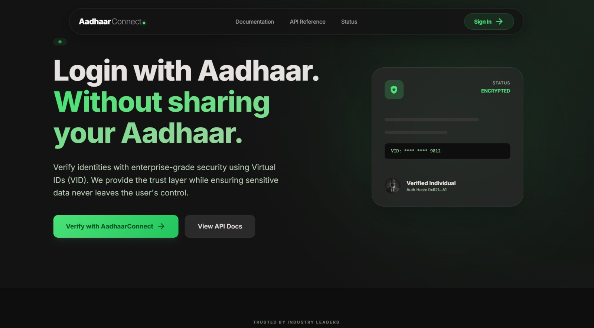
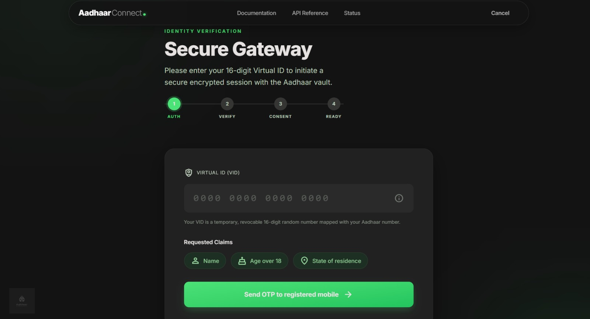
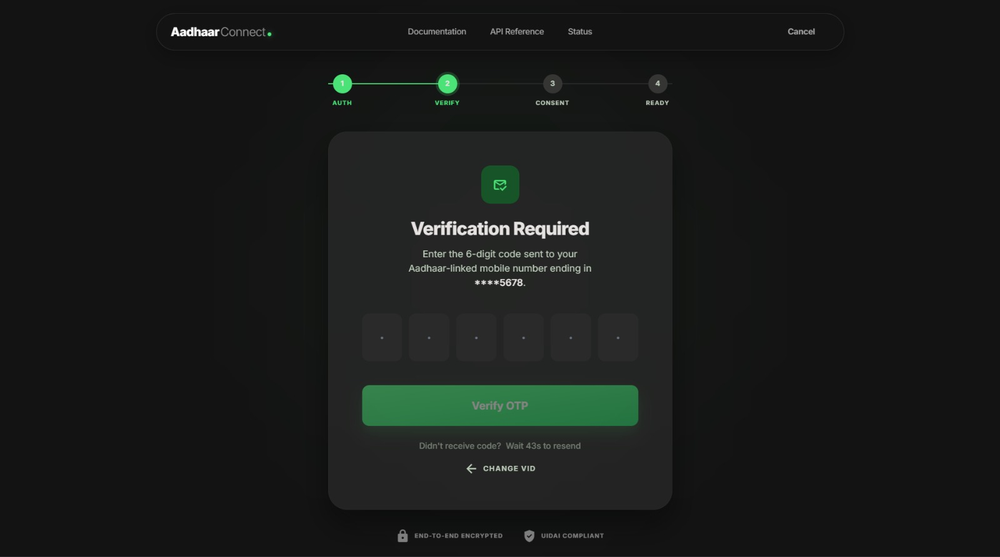
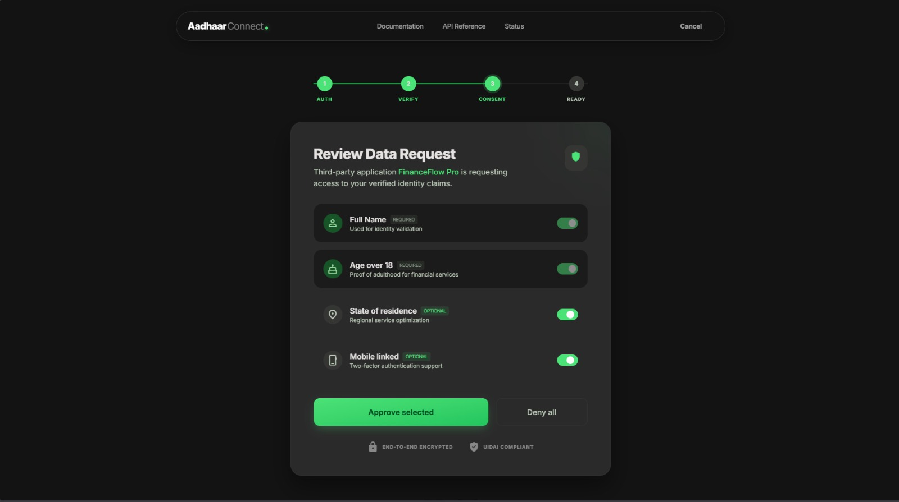
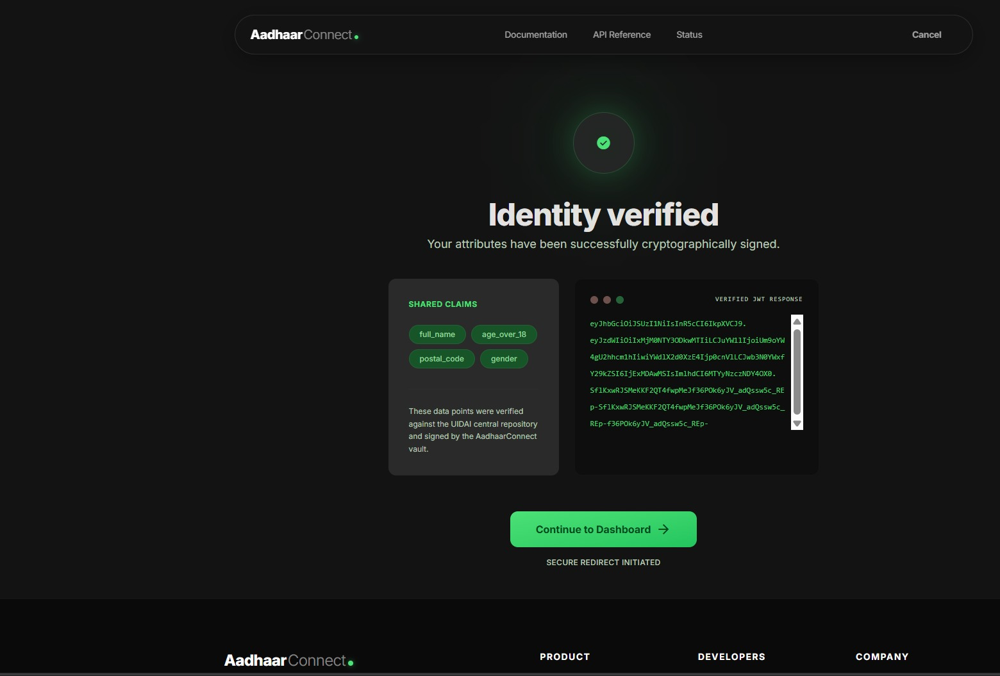
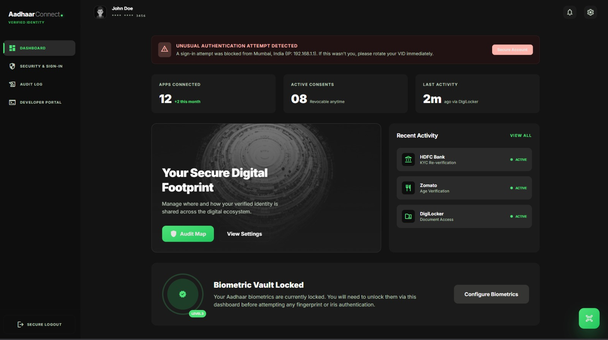
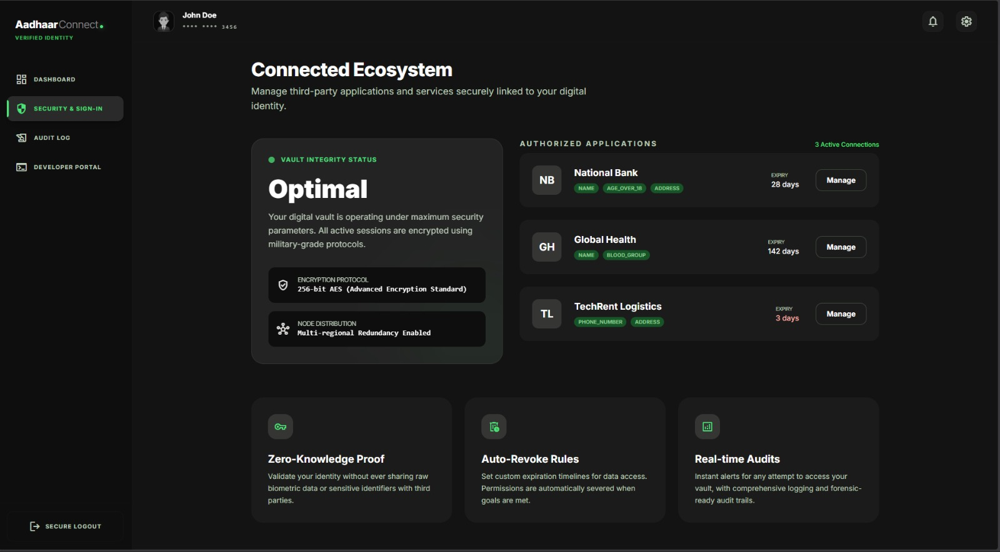
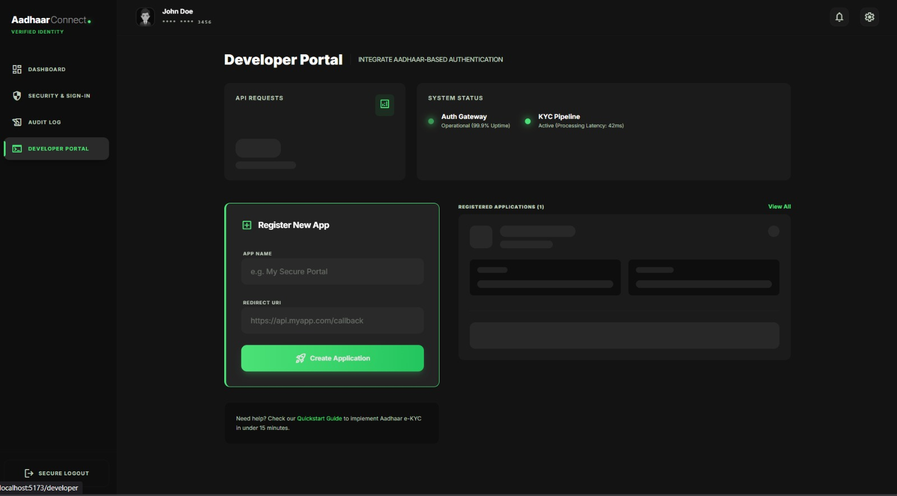

# 🖥️ AadhaarConnect Frontend Documentation

---

## Overview

**AadhaarConnect** is a React-based frontend application built using **Vite** and styled with **Tailwind CSS**.

The primary goal of the UI is to provide a **Zero-Knowledge Identity Gateway**, allowing users to verify their identity using **Aadhaar Virtual IDs (VID)** without exposing their actual Aadhaar number.

### Design Highlights
- Glassmorphism UI
- Semantic color tokens (`surface-container`, `primary`, `on-surface-variant`)
- Bento grid layouts
- Gradient-based modern backgrounds
- Inspired by Material Design 3 principles

---

## Routing Structure

The app uses `react-router-dom` for navigation.

###  Active Routing File:
- `src/App.jsx`

###  Note:
- `src/routes/AppRouter.jsx` exists (lazy-loaded + PrivateRoute)
- Currently NOT active (based on `main.jsx`)

---


1. **`/` (Landing)**: The main marketing and introductory page.

2. **`/vid` (Identity Gateway)**: The first step of the authentication flow where users input their 16-digit Virtual ID.

3. **`/otp` (OTP Verification)**: The step following VID submission for second-factor verification.

4. **`/consent`**: UI for reviewing and providing data consent.

5. **`/success`**: A completion/success indicator page.

6. **`/dashboard`**: The authenticated user's central control center.

7. **`/app-detail`**: Drill-down view into specific app connections.
8. **`/security`**: User security configurations.

9. **`/audit`**: An "Audit Map" interface for tracking identity usage over time.

10. **`/developer`**: Dashboard or documentation for API integrators.


---

## User Flow

### 1️⃣ Entry Point: Landing Page (`/`)
**Purpose:**
- Introduces AadhaarConnect
- Explains privacy-first identity verification

**User Action:**
- Explore features
- Proceed to login

---

### 2️⃣ Login Flow (`/vid`)
**Input:**
- 16-digit Virtual ID (VID)

**Process:**
- Secure verification
- No password required

**Outcome:**
- Role identification:
  - Citizen
  - Developer
  - Admin

---

### 3️⃣ OTP Verification (`/otp`)
- OTP sent to registered mobile
- 3 attempts allowed
- Failure → 15-minute lockout

---

### 4️⃣ Consent Screen (`/consent`)
- User reviews requested data
- Can approve or deny access

---

### 5️⃣ Success (`/success`)
- Authentication complete
- Secure token generated

---

## Role-Based Dashboards

###  Citizen Dashboard
- OTP authentication
- Consent control
- View connected apps
- Revoke access anytime

---

### Developer Dashboard
- App registration
- Generate `client_id` and `client_secret`
- Request user data (claims)
- Test authentication flow

---

###  Admin Dashboard
- Approve/reject applications
- Audit monitoring (no PII exposure)
- System activity tracking

---

## Key Operational Flow

### 🔹 VID Entry
- User enters VID
- Sent for verification
- Discarded after use

---

### 🔹 OTP Verification
- Second-factor authentication
- Max 3 attempts

---

### 🔹 Data Handling
- Secure e-KYC fetch
- Only required claims extracted
- Remaining data discarded

---

### 🔹 Consent Approval
- User approves data sharing

---

### 🔹 Token Generation
- JWT token generated with selected data

---

##  Frontend Workflow Diagram

```
Landing (/)
   ↓
VID Entry (/vid)
   ↓
OTP Verification (/otp)
   ↓
Consent (/consent)
   ↓
Success (/success)
   ↓
Dashboard (/dashboard)
   ↓
├── Security (/security)
├── Audit (/audit)
└── App Detail (/app-detail)
```


---